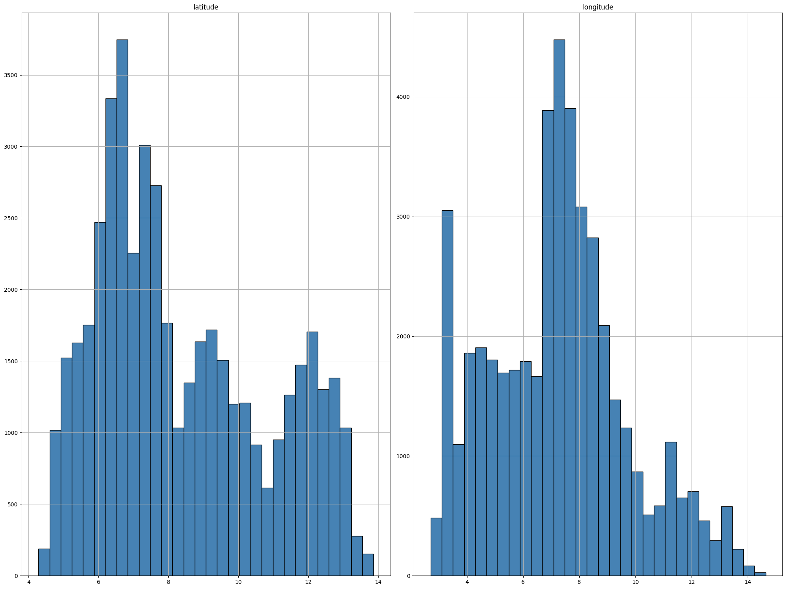
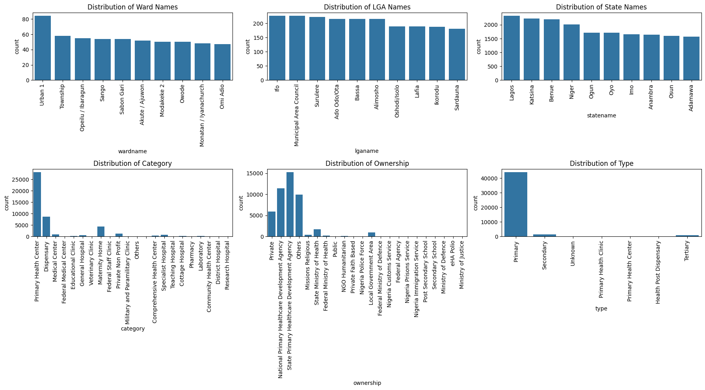
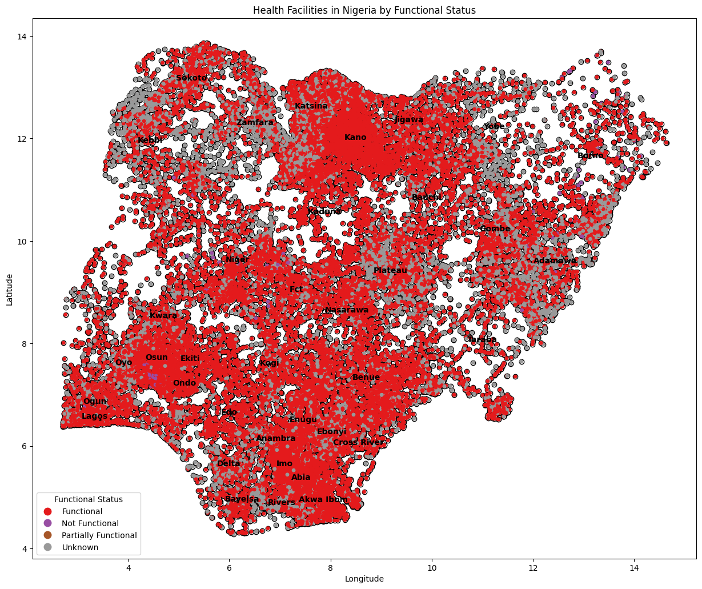

# Healthcare-Functionality-Project--Xgboosting
<!-- About The Project -->

<!-- TABLE OF CONTENTS -->

Table of Contents

<ol>
  <li><a href="#description">Description</a></li>
  <li><a href="#dataset">Dataset</a></li>
     <li><a href="#exploratory-data-analysis">Exploratory Data Analysis</a></li>
    <ul>
      <li><a href="#visualize-numerical-feature-distribution">Visualize Numerical Feature Distribution</a></li>
      <li><a href="#visualize-categorical-feature-distribution">Visualize Categorical Feature Distribution</a></li>
      <li><a href="map-visualization-of-health-facilities">Map Visualization of Health Facilities</a></li>     
    </ul>
  </li>
  </li>
</ol>

# Author: Lilian Ngonadi

# Description

- This project addresses a classification machine learning challenge focused on utilizing the GRID3 NGA Health Facilities dataset. The objective is to categorize health facilities across Nigeria based on operational status, utilizing the **XGBOOST algorithm** to enhance prediction accuracy.
- By integrating this rich geospatial dataset, the project aims to improve resource allocation and planning for healthcare services, targeting facilities based on their functionality and operational needs.

# Dataset

The dataset train.csv is employed for training a model to classify health facilities in Nigeria based on operational status using the GRID3 NGA Health Facilities dataset. It comprises records of 245,725 health facilities, each characterized by selected attributes:
- **Latitude** : Geographical latitude of the facility.
- **Longitude** : Geographical longitude of the facility.
- **Wardname** : Name of the ward where the facility is located.
- **Lganame** : Local Government Area of the facility.
- **Statename** : State in which the facility is located.
- **Category** : Category of the health facility (e.g., hospital, clinic).
- **Ownership** : Whether the facility is government-owned, private, or other.)
- **Type** : Type of health facility (e.g., general hospital, specialist clinic)
- **Func_Stats** : Functional status of the facility indicating if it is operational, not operational, partially operational, or status unknown (encoded as functional, non-functional, partially functional, unknown).

- This dataset provides a comprehensive view of the health facilities' geographical distribution and operational characteristics, facilitating targeted interventions and resource allocation.

# Exploratory Data Analysis
* To understand the dataset an exploratory data analysis was carried out to visualize the various features of [GRID3 NGA Health Facilities dataset:](https://data.grid3.org/datasets/1b358b47e41244cbaaccb640d9a4bfc9_0/about)

## Visualize Numerical Feature Distribution

These plots highlight areas with higher and lower densities of healthcare facilities, which helped in identifying regions that might be underserved or over-served.

## Visualize Categorical Feature Distribution

- Urban 1 and Ifo are the most common ward and LGA names, indicating concentrated healthcare facility locations, likely due to higher population or focused healthcare investments.
- Lagos, Katsina, and Benue have the highest facility counts, aligning with population and administrative healthcare priorities.
- Most healthcare facilities are "Primary Health Centers," underscoring primary care's centrality in the healthcare system, with fewer General and Specialist Hospitals.
- The healthcare sector is predominantly privately owned, suggesting a significant private sector presence, supplemented by government and community facilities.
  

### Map Visualization of Health Facilities
The map shows the functional status of health facilities across Nigeria, with functional facilities primarily concentrated in urban areas like Lagos and Kano. Non-functional facilities are scattered throughout the country, often in less developed regions. Partially functional facilities are also widespread, indicating operational challenges. Regions like the northern states and economically vibrant southern areas exhibit a mix of all facility statuses. This visual data aids policymakers in identifying areas needing targeted healthcare infrastructure improvements.

